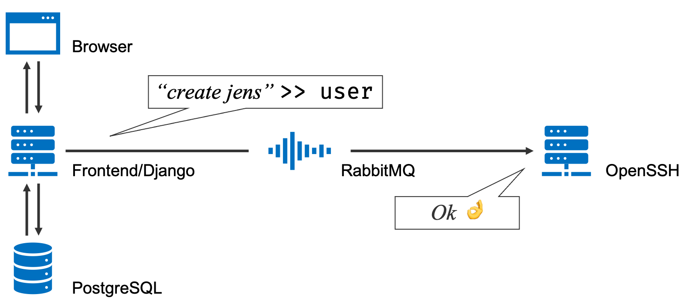

# Architecture

## Git

The git host is a simple ssh / sftp server that can be connected to using git. The server listens to the message queue for user and repo creates and deletions.

## Message queue

RabbitMQ

### Messages

* `queue :: command`
* `user :: create username`
* `user :: delete username`
* `user :: set_authorized_keys username authorized_keys`
* `repo :: create username reponame`
* `repo :: delete username reponame`

## Database

PostgreSQL

## Frontend

Django web server for submitting ssh keys and creating repositories.

## nginx

Handles authentication and http redirects.
